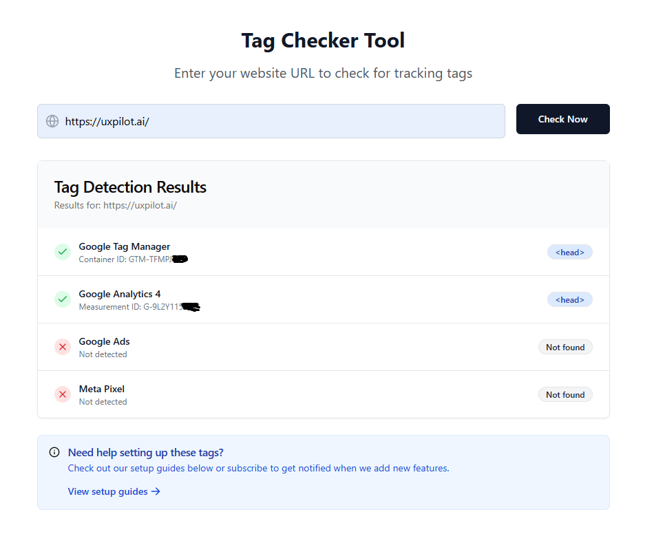

# Tracking Tool Checker

A modern web application for checking and validating tracking tools and tags on websites. Built with React, TypeScript, and Express.js.

## Features

- Website URL tag checking and validation with real-time analysis
- Modern, responsive UI built with Tailwind CSS and Shadcn UI
- Real-time tag detection and monitoring via WebSocket
- RESTful API with TypeScript type safety
- Secure authentication with Passport.js
- PostgreSQL database with DrizzleORM for type-safe queries

## Tech Stack

### Frontend
- React 18 with TypeScript
- Vite for build tooling
- TailwindCSS with animations and typography plugin
- Shadcn UI (built on Radix UI)
- Tanstack React Query for data fetching
- Wouter for lightweight routing
- React Hook Form with Zod validation
- Framer Motion for animations
- Recharts for data visualization

### Backend
- Express.js with TypeScript
- DrizzleORM with PostgreSQL (via Neon Serverless)
- Passport.js with local authentication
- Express Session with PostgreSQL store
- WebSocket support for real-time features

## Getting Started

### Prerequisites

- Node.js (v20 or later)
- npm or yarn

### Installation

1. Clone the repository
```bash
git clone https://github.com/kave-me/tracking-tool-checker-react-express.git
cd TrackingToolChecker
```

2. Install dependencies
```bash
npm install
```

3. Set up environment variables
Create a `.env` file in the root directory with necessary configurations.

### Development

Start the development server:
```bash
npm run dev
```

The application will be available at `http://localhost:5000`

### Building for Production

```bash
npm run build
```

To start the production server:
```bash
npm start
```

## Project Structure

```
├── client/                # Frontend React application
│   ├── index.html
│   └── src/
│       ├── components/    # Reusable UI components
│       ├── hooks/        # Custom React hooks
│       ├── lib/          # Utility functions and configurations
│       ├── pages/        # Page components
│       ├── App.tsx       # Main application component
│       └── main.tsx      # Application entry point
├── server/               # Backend Express application
│   ├── services/         # Business logic and services
│   │   └── tagDetector.ts # Tag detection service
│   ├── routes.ts         # API route definitions
│   ├── storage.ts        # Database configuration
│   └── index.ts         # Server entry point
├── shared/               # Shared types and schemas
│   ├── schema.ts        # Database schemas
│   └── types.ts         # Shared TypeScript types
└── drizzle.config.ts    # DrizzleORM configuration
```

## Features

### Tag Detection
- Automated scanning of websites for tracking tools
- Support for multiple tag types and tracking solutions
- Detailed reporting and analysis



### Blog System
- CMS integration for content management
- Markdown support
- SEO-friendly blog posts


## License

MIT
